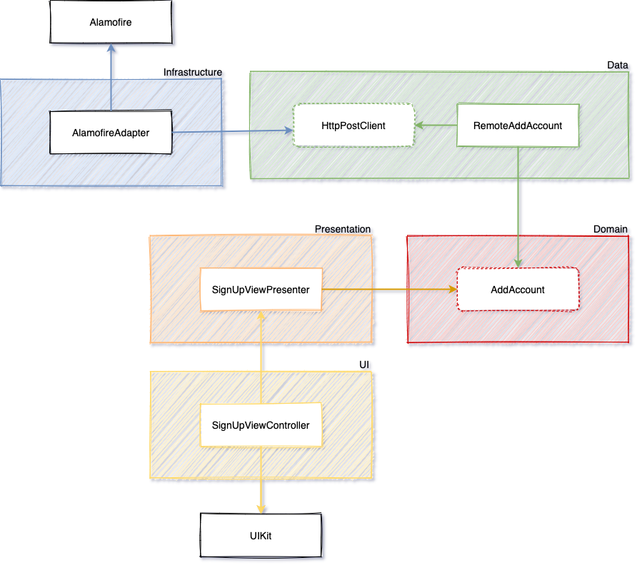

# Swift Clean Architecture

This sample project is inspired by Rodrigo Manguinho's [course](https://www.udemy.com/course/swift-tdd-com-mango/).

## Project includes
- TDD
- Code Coverage
- Clean Architecture
- Design Patterns
- SOLID
- MVP Architecture
- Protocol-Oriented Programming
- Swift Package Manager
- SwiftLint

## Modules

